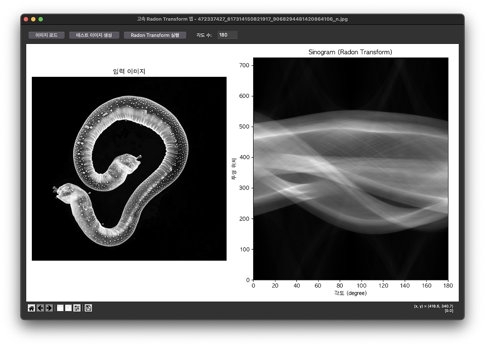

# Fast Radon Transform using Fourier Slice Theorem

Efficient implementation of the Radon Transform using the Fast Fourier Transform (FFT) and the Fourier Slice Theorem in Python, with a Tkinter-based GUI for interactive usage.



## Overview

The Radon Transform is an integral transform that computes projections of an image matrix along specified angular directions. This implementation uses the Fourier Slice Theorem to perform the transform efficiently:

1. Instead of direct line integral calculations (which are computationally expensive), the algorithm:
   - Takes the 2D FFT of the input image
   - Samples the Fourier domain along radial lines (for each projection angle)
   - Applies inverse 1D FFT to obtain the projections

2. This approach significantly reduces computational complexity from O(N³) to O(N² log N).

## Features

- Fast Radon Transform implementation using FFT
- Interactive GUI with Tkinter
- Image loading from various file formats
- Test image generation for quick experimentation
- Adjustable number of projection angles
- Visualization of both input image and resulting sinogram
- Bilinear interpolation for accurate Fourier domain sampling

## Requirements

- Python 3.x
- NumPy
- SciPy
- Matplotlib
- Tkinter
- PIL (Pillow)

## Installation

```bash
# Clone the repository
git clone https://github.com/bemoregt/FastRadonTransform_using_FourierSliceTheorem.git
cd FastRadonTransform_using_FourierSliceTheorem

# Install dependencies
pip install numpy scipy matplotlib pillow
```

## Usage

Run the main script:

```bash
python fast_radon_transform.py
```

### GUI Controls

- **이미지 로드**: Load an image from your filesystem
- **테스트 이미지 생성**: Generate a test image (circle)
- **Radon Transform 실행**: Execute the Radon Transform
- **각도 수**: Number of projection angles (default: 180)

## Implementation Details

### Key Functions

- `fast_radon_transform(image, angles)`: Main function implementing the Fourier Slice Theorem
  - Pads input image to handle rotations properly
  - Applies circular mask to avoid artifacts
  - Uses bilinear interpolation for precise sampling in Fourier domain

- `RadonTransformApp`: Tkinter application class
  - Handles UI events and image display
  - Processes and displays transform results

### Algorithm Steps

1. Pad the input image to accommodate rotations
2. Apply circular mask to avoid edge artifacts
3. Compute the 2D FFT of the padded image
4. For each projection angle:
   - Sample the 2D FFT along the corresponding radial line
   - Use bilinear interpolation for accurate sampling
   - Apply 1D inverse FFT to get the projection
5. Assemble all projections into a sinogram

## Applications

The Radon Transform is used in:
- Medical imaging (CT scanning)
- Material science
- Geophysics
- Computer vision

## License

[MIT License](LICENSE)